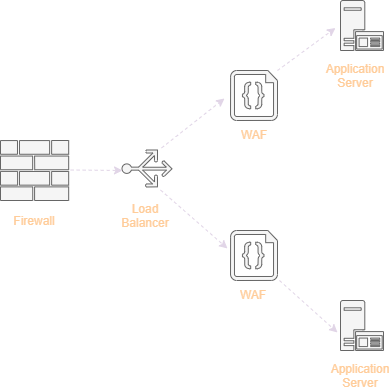

One of our clients, a mid sized company, wanted to scale up the security architecture of their client facing website. As per the terms of reference, they wanted minimum disruption in their existing workflow. Having any kind of code review, penetration testing or code rewrite was not on the platter. Hmmm!!! we thought lets give it a shot. They have this typical architecture in which the website was hosted on Virtual Private Servers (VPS). 

>The first step we thought was to minimise the attack surface of our infrastructure which includes the website itself and the hosted environment and then to stop any malicious requests trying to directly hit the APIs.

Now, having worked out the design goals, we went about reworking the architecture. Of course there are many ways to go about the security architecture, but one of the ways was to introduce the following artifacts. 

{{site.data.alerts.callout_default}}
 - Infrastructure Firewall
 - Proxy / Load balancer
 - Web Application Firewall
{{site.data.alerts.end}}

{: .align-center }

## Infrastructure Firewall
The infrastructure firewall will take care that all traffic except that meant for `http` and `https` is dropped at our Virtual Private Server (VPS). We can also configure the firewall in a way in which our proxy/load balancers are accessible from specific IPs/subnets. Some of the sample rules in our `firewalld` of CentOS7 as given here:

Firewalld Rules
```bash
# Create a trusted Zone having specific IP
firewall-cmd --permanent --add-source=10.10.10.10 --zone=trusted &
# Add service http and https to the trusted zone
firewall-cmd --permanent --add-service=http --zone=trusted &
firewall-cmd --permanent --add-service=https --zone=trusted &
# Remove service http and https from the public zone
firewall-cmd --permanent --remove-service=http --zone=public &
firewall-cmd --permanent --remove-service=https --zone=public &
firewall-cmd --reload
```

## Proxy / Load balancer
The proxy will ensure that our website is not directly exposed to the outside world and has additional benefits of load balancing. We can setup Access Control Lists (ACLs) so that only specific endpoints of our website APIs are accessible from outside. This will also safeguard any accidental exposure of our internal APIs. Some of the sample configuration settings for the HAproxy could be as follows: 

HAProxy Config Rules
```bash
frontend httpsandhttp
        bind *:80
        bind *:443 ssl crt /etc/ssl/haproxy.pem
        # Redirect traffic to https        
        http-request redirect scheme https unless { ssl_fc }
        mode http
        acl app1 path_end -i /app1
        acl app2 path_end -i /app2    	
    	use_backend app1Servers if app1 
    	use_backend app2Servers if app2

backend app1Servers
        balance roundrobin        
        mode http
        server webserver1 127.0.0.1:2222 check weight 1 maxconn 50 ssl verify none
        
backend app2Servers
        balance roundrobin        
        mode http
        server webserver2 127.0.0.1:3333 check weight 1 maxconn 50 ssl verify none
```
## Web Application Firewall
The traffic from our proxy now goes through the Web Application Firewall. This is configured to thwart common web application vulnerabilities. We could use the open source WAF like ***modsecurity*** or vendor dependent one. The WAFs also have the settings to configure it as proxy for sending the actual website traffic. We can run everything in a containerised environment using docker or Kubernetes.

#### Reference
- https://www.youtube.com/watch?v=qYnA2DFEELw
- https://www.haproxy.com/blog/redirect-http-to-https-with-haproxy/

