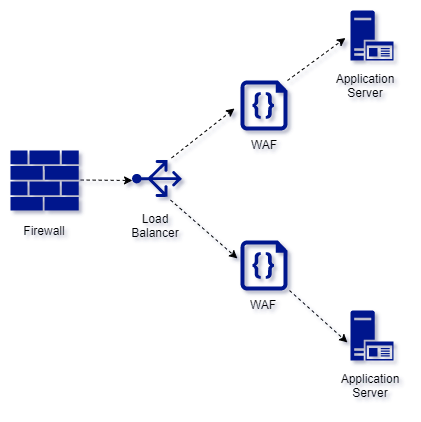

*This article was originally published on [LinkedIn](https://www.linkedin.com/feed/update/urn:li:ugcPost:6806848386835238912?updateEntityUrn=urn%3Ali%3Afs_feedUpdate%3A%28*%2Curn%3Ali%3AugcPost%3A6806848386835238912%29)*

The path towards CISSP is a meandering one. There are conflicting choices, which one to choose, when both seem to be appropriate. What we choose largely depends upon our world view formed by our experiences. I was going through this question in Luke Ahmed's book *[How To Think Like A Manager](https://www.amazon.com/gp/product/1735085197/ref=as_li_tl?ie=UTF8&camp=1789&creative=9325&creativeASIN=1735085197&linkCode=as2&tag=stunotandth06-20&linkId=5ad2a43b972878466ba16677bbcd0a19)* on risk oversight vs risk-based decisions. Well it got me thinking and I shot a scenario at Luke to seek his point of view on risk oversight vs risk-based decisions.

# Scenario poised at Luke

Rymar Tech is a products company and has a policy in which the username of its subscribers is not sensitive information. It can be known and shared with anyone. Now, during the vulnerability assessment process, it has come to the fore that their systems are susceptible to brute forcing of usernames. It requires a security upgrade and entails spending of thousands of dollars to fix the problem. In the pandemic times the company revenues are affected. The company is at the risk of losing its reputation as all the usernames may be made public or sold on darknet. Now the management has to decide. This decision making will come under which head : risk oversight or risk-based decisions?

# Luke's Response

The difference between the board and management is that management is responsible for the actions that are involved in risk management.

The board does not make any decisions for the company when it comes to narrow risk-based decisions, that is left up to the company's management. The board is there to make sure management has a risk management program, that is the oversight. The job of the board of directors is to hold management accountable, but not to make the actual decisions in the organization, that's what separates the board from management.

Remember that what is happening in the context of the question is an actual risk assessment. A risk assessment gathers important information about the information systems of the organization. After the assessment occurs a risk analysis. The results of the risk analysis are then sent to management for approval, to make risk-based decisions. In our CISSP books, risk-based decisions are approved by management.

So with this, risk oversight belongs with the board (the ones who make sure management is doing their job).

Making risk-based decisions that directly affect the company belongs with management, the question asks for the primary reason for "management's" new initiative.

In the back of the book you will see a list of sources used for each question. In the realm of oversight, I used *[this](https://www.icgn.org/sites/default/files/ICGN%20Corp%20Risk%20Oversightweb_0.pdf)* source for this question to distinguish between the responsibilities of the board and management.

In it, it states "The board has the task of overseeing management’s implementation of strategic and operational risk management".

*Note : This conversation has been published after seeking permission from Luke Ahmed. However, author is solely responsible for any technical errors due to oversight.*


Let us take a case of a mid sized company which wants to scale up its security architecture for the client facing website. As per the terms of reference, they want minimum disruption in their existing workflow and any kind of code rewrite is not on the platter. They have a classic deployment in which the website is hosted on Virtual Private Servers (VPSs). 

>We can have a two pronged strategy here, first to minimize the attack surface and then to monitor all the ingress traffic for any malicious content. This can be done by limiting access to hosted infrastructure (VPS). Only `https` traffic on default port `443` should be allowed at ingress of the VPS, all other traffic to be dropped. We also need to limit the access to web APIs. The internal APIs should not be exposed to external traffic and all incoming traffic on the exposed public APIs should be monitored.

Now, having worked out the design goals, we can rework the architecture of our deployment. Of course there are many ways to go about the security architecture, but one of the ways is to enable/introduce following artifacts. 

{{site.data.alerts.callout_default}}
 - Infrastructure Firewall
 - Proxy / Load balancer
 - Web Application Firewall
{{site.data.alerts.end}}

{: .align-center }

## Infrastructure Firewall
The infrastructure firewall will take care that all traffic except that meant for `http` and `https` is dropped at our Virtual Private Server (VPS). We can also configure the firewall in a way in which our proxy/load balancers are accessible from specific IPs/subnets. Some of the sample rules in our `firewalld` of CentOS7 as given here:

Firewalld Rules
```bash
# Step 1: Create a trusted Zone having whitelisted IP / subnet.
firewall-cmd --permanent --add-source=10.10.10.10 --zone=trusted &

# Step 2: Add service http and https to the trusted zone
firewall-cmd --permanent --add-service=http --zone=trusted &
firewall-cmd --permanent --add-service=https --zone=trusted &

# Step 3: Remove service http and https from the public zone
firewall-cmd --permanent --remove-service=http --zone=public &
firewall-cmd --permanent --remove-service=https --zone=public &
firewall-cmd --reload
```

## Proxy / Load balancer
The proxy will ensure that our website is not directly exposed to the outside world and has additional benefits of load balancing. We can setup Access Control Lists (ACLs) so that only specific endpoints of our website APIs are accessible from outside. This will also safeguard any accidental exposure of our internal APIs. Some of the sample configuration settings for the HAproxy could be as follows: 

HAProxy Config Rules
```bash
frontend httpsandhttp
        bind *:80
        bind *:443 ssl crt /etc/ssl/haproxy.pem
        # Redirect traffic to https        
        http-request redirect scheme https unless { ssl_fc }
        mode http
        acl app1 path_end -i /app1
        acl app2 path_end -i /app2    	
    	use_backend app1Servers if app1 
    	use_backend app2Servers if app2

backend app1Servers
        balance roundrobin        
        mode http
        server webserver1 127.0.0.1:2222 check weight 1 maxconn 50 ssl verify none
        
backend app2Servers
        balance roundrobin        
        mode http
        server webserver2 127.0.0.1:3333 check weight 1 maxconn 50 ssl verify none
```
## Web Application Firewall
The traffic from our proxy now goes through the Web Application Firewall. This is configured to thwart common web application vulnerabilities. We could use the open source WAF like ***modsecurity*** or vendor dependent one. The WAFs also have the settings to configure it as proxy for sending the actual website traffic. We can run everything in a containerised environment using docker or Kubernetes.

#### Reference
- https://www.youtube.com/watch?v=qYnA2DFEELw
- https://www.haproxy.com/blog/redirect-http-to-https-with-haproxy/

